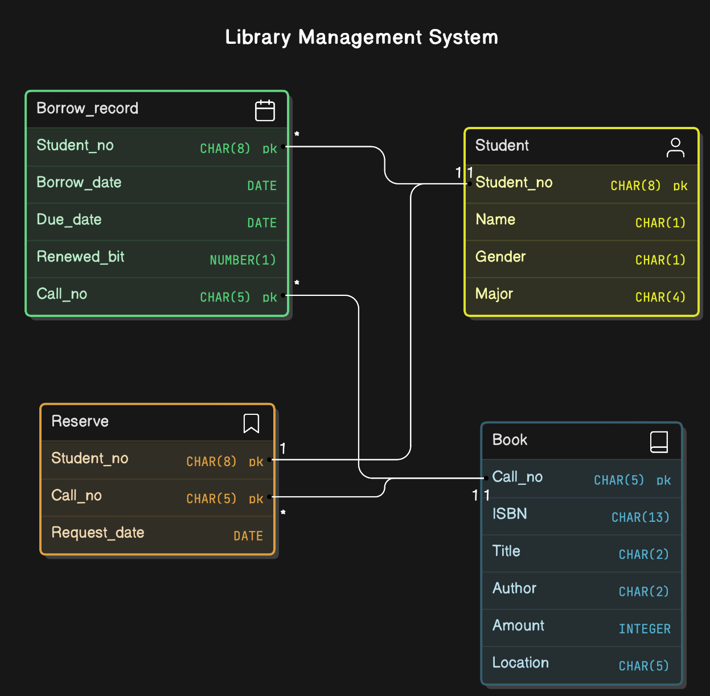

# Library Management System - JDBC

This is a simple library management system built using Java, JDBC, and Oracle Database. The project allows users to perform operations such as searching, borrowing, returning, renewing, and reserving books.

## Features

- **Book Search**: Search for a book by ISBN.
- **Book Borrowing**: Borrow a book using a student number and book call number.
- **Book Return**: Return a borrowed book.
- **Book Renew**: Renew a borrowed book.
- **Book Reserve**: Reserve a book for future borrowing.
- **Oracle Database Connection**: Connects to an Oracle database, optionally using an SSH tunnel.

## Technologies Used

- Java
   - JDBC (Java Database Connectivity)
   - JSch (SSH tunneling for database connection)
   - AWT, Swing (Login GUI)
   - Log4j2 (Logging)
- SQL (Oracle Database)
  - DDL (CREATE, DROP)
  - DML (INSERT, UPDATE, DELETE, TRIGGER)
  - DQL (SELECT)
  - TCL (COMMIT)

## Database Design
### ERD Diagram

Below is the ERD diagram for the database schema used in this project:



- Students can borrow or reserve books.
- The Borrow_record tracks which books are borrowed, when, and for how long.
- The Reserve table manages reservations, specifying which books students have reserved and the date of the request.
- Each student can make only one reservation.

## Getting Started

### Prerequisites

Ensure you have the following installed on your system:

- Java 8 or higher
- Oracle Database (or access to an Oracle DB instance)
- SSH access (if using an SSH tunnel)
- Maven (optional, for dependency management)

### Database Setup (Oracle DB)

1. **Drop Existing Tables (if needed)**

   Before creating new tables, ensure any existing tables with the same names are removed to avoid conflicts. Run the `drop_table.sql` script to drop existing tables if they exist.

2. **Setup Database Schema and Sample Data**

   Use the `sample_data.sql` file to set up the database schema and populate it with sample data. This script will create the necessary tables and insert initial data to get your database ready for use. Execute this script on your Oracle Database to create tables and insert sample records.

**Note:** Make sure to run `drop_table.sql` before executing `sample_data.sql` to ensure a clean setup.

### Running the Project

1. **Clone the repository**:

   ```bash
   git clone https://github.com/SusanLYC/Library-Management-System.git
   cd library-management-system
   ```

2. **Configure Database Connection**:

   The database connection is managed in the `DatabaseConnection` class. Please set the connection parameters before running:

   - **Database Host**: `dbhost.example.com`
   - **Database Port**: `1521` (Oracle DB)
   - **Database Name**: `db.name`
   - **Proxy Host**: `proxy.example.com` (if SSH tunneling is used)
   - **SSH Port**: `22` (if SSH tunneling is used)

   If you’re using an SSH tunnel to connect to the database, the application will prompt you to login via SSH. Otherwise, you will be prompt to the database login.

3. **Compile and Run**:

   You can use any Java IDE like IntelliJ IDEA or Eclipse to run the project. Alternatively, you can run the project from the command line:

   ```bash
   javac -d bin src/jdbc/LibrarySys/*.java
   java -cp bin jdbc.LibrarySys.LibraryManager
   ```

4. **Login to the Database**:

   The application will prompt you for your Oracle database credentials when you attempt to log in.

5. **Interact with the Application**:

   Once the application is running, you’ll see the following menu options:

   ```
   Please choose an option:
   1. Book Search
   2. Book Borrow
   3. Book Return
   4. Book Renew
   5. Book Reserve
   6. Exit
   ```

   Select an option by entering the corresponding number and follow the prompts.
   
## Contributing
   
   If you'd like to contribute to this project, please fork the repository and submit a pull request.
